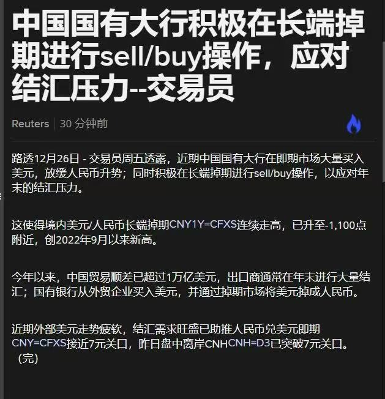

# 深度分析：中国国有大行外汇市场操作解读
**日期**: 2025年12月26日

## 核心事件 Recap
根据路透社报道，中国国有大行近期在外汇市场采取了“**即期买入美元 + 掉期 Sell/Buy**”的组合操作。
*   **即期市场 (Spot)**: 大量买入美元。
*   **掉期市场 (Swap)**: 进行 Sell/Buy 操作（即卖出近端美元，买入远端美元）。

---

## 为什么要这样做？(Why?)

这种组合操作通常被视为一种“**冲销式干预**”或流动性管理手段，其背后的战略意图主要包含以下两个方面：

### 1. 缓解人民币即期升值压力 (Stabilizing Spot Rate)
*   **背景**: 中国今年贸易顺差巨大（超 1 万亿美元），且临近年底，出口商有大量回款结汇（卖美元买人民币）支付工资和奖金的需求。
*   **压力**: 这种集中结汇行为会导致市场上美元供过于求，推高人民币汇率。如果人民币升值过快，将损害出口企业的竞争力。
*   **操作**: 国有大行入场在**即期市场买入美元**，承接了出口商的抛盘。
*   **目的**: 增加美元需求，平抑人民币过快升值的势头，将即期汇率维持在相对稳定的水平（文章提到维持在 7.0 附近）。

### 2. 转移压力与流动性管理 (Liquidity & Validating Forward Pressure)
单纯的即期买入虽然稳定了汇率，但会给银行带来两个问题：
1.  **持有大量美元头寸**: 银行可能不希望长期持有过多的美元风险敞口。
2.  **向市场投放了过量人民币**: 买入美元意味着卖出人民币，这增加了市场的人民币流动性。

因此，银行配合使用了 **长端掉期 Sell/Buy 操作**：
*   **Sell (近端/即期脚)**: 银行将刚才在即期市场买入的美元，通过掉期的近端卖出，换回人民币。
    *   *作用*: 这样既平掉了即期的美元头寸，又回笼了刚才投放的人民币流动性。
*   **Buy (远端/远期脚)**: 约定在未来（一年后）再买回美元。
    *   *作用*: 这相当于把现在的“美元买盘”推迟到了未来。

### 总结：两全其美的策略
通过这套组合拳（即期买入 + 掉期 Sell/Buy），央行/国有大行实际上达成了一个效果：
*   **在即期市场**: 吸收了美元供给，阻止了人民币现在升值。
*   **在掉期市场**: 将这些美元需求转移到了长端（远期）。
    *   这就是为什么文章中提到“长端掉期 CNY1Y=CFXS 连续走高”。因为银行在远端大量买入美元（Buy），推高了掉期点。

这种操作也就是用“**掉期市场的价格上涨**”（升水/掉期点走高）换取了“**即期汇率的稳定**”。这是一种典型的以时间换空间的操作手法，旨在平滑年末季节性的汇率波动。

---

## 深度解读：人民币升值过快对出口企业的影响

“人民币升值”意味着同样数量的美元能换到的人民币变少了。对于中国这样以制造业和出口为导向的经济体，汇率过快升值会产生多重负面打击：

### 1. 利润变薄甚至亏损 (Profit Compression)
这是最直接的打击。
*   **场景**: 假设一家外贸工厂接到 100 万美元订单。
*   **成本**: 生产成本（工人工资、厂房租金、水电、国内原材料）都是用**人民币**结算的。
*   **算账**:
    *   **汇率 7.2 时**: 100 万美元 = 720 万人民币。假设成本 700 万，利润 **20 万**。
    *   **汇率升至 7.0 时**: 100 万美元 = 700 万人民币。假设成本不变，利润 **0**。
    *   **汇率升至 6.8 时**: 100 万美元 = 680 万人民币。直接亏损 **20 万**。
*   **结论**: 对于许多净利率仅为 3%-5% 的中小制造企业来说，汇率波动 3-5% 可能直接抹平所有利润，甚至导致“做得越多，亏得越多”。

### 2. 削弱国际价格竞争力 (Loss of Competitiveness)
为了维持人民币端的利润，企业不得不提高美元报价。
*   **提价后果**: 只要提价，外国客户（如美国超市、欧洲采购商）的采购成本就会增加。
*   **订单转移**: 客户可能会转向汇率更贬值、价格更低廉的国家（如越南、印度、墨西哥等）进行采购。一旦客户转移，供应链关系断裂，很难在短期内恢复。

### 3. 产生汇兑损失 (Exchange Losses)
*   出口企业从接单到发货再到收到货款（账期），通常需要数月时间。
*   如果在这期间人民币大幅升值，企业账面上原本预计的收入在实际结汇时会大幅缩水，造成财务报表上的巨大汇兑损失。

### 4. 经营预期不稳 (Uncertainty)
*   汇率由于波动过大，企业不敢接长单（长周期订单），只敢接短单。
*   这导致企业难以安排长期生产计划和产能扩充，阻碍了再投资和产业升级。

**综上所述**，国有大行出手干预，防止人民币“升值过快”，本质上是在**保出口、保就业、保制造业的基本盘**，为企业争取调整和转型的时间窗口。

---

## 深度解读：银行面临的双重约束

在干预汇率时，银行为什么不能“只买即期美元”？因为如果不配合掉期操作，单纯的即期干预会触碰到银行的两个痛点：

### 1. 为什么不能“持有大量美元头寸”？ (USD Position Risk)
这涉及到银行的**风险控制**和**合规要求**。
*   **汇率风险 (Exchange Rate Risk)**: 银行也是企业，需要自负盈亏。
    *   如果银行手里攒了 100 亿美元的“多头”（Long Position），一旦美元在未来贬值（或者人民币继续大幅升值），银行账面上就会出现巨额亏损。银行交易员（Dealer）有严格的止损线（Limit），不能无限制地裸露风险。
*   **监管限额 (Regulatory Limits)**:
    *   监管机构（如外管局 SAFE）对银行的**结售汇综合头寸（Net Open Position）**是有严格额度限制的。银行不能想买多少就买多少，一旦超过这个限额（头寸上限），就必须平盘（把手里的美元卖出去）。
*   **资金占用 (Capital Cost)**:
    *   持有美元需要占用银行的人民币资金。如果这些美元不能产生足够的收益，就是对银行资本的浪费。

**解决办法**: 通过**掉期（Swap）中的即期端卖出（Sell Spot）**，银行把刚才买进来的美元又“卖”了回去（虽然是卖给掉期市场，并约定未来买回）。这样一来，银行手里的**即期头寸就被抹平了**，不再承担即期的汇率波动风险，同时也符合了监管的头寸限额要求。

### 2. 什么是“向市场投放了过量人民币”？ (Excessive RMB Liquidity)
这涉及到**货币政策**和**通胀控制**。
*   **基础货币投放原理 (Base Money Creation)**:
    *   当国有大行在即期市场上用人民币买入美元时，实际上是在**创造货币**。
    *   流程：银行账户里的 7 亿人民币 -> 支付给出口商 -> 出口商存入商业银行 -> 市场上的基础货币总量增加 7 亿。
*   **后果**:
    *   如果不加控制，这种大规模的买入会导致市场上的人民币**泛滥**。
    *   **利率失控**: 钱太多会导致银行间市场利率（如 DR007）跌破央行的目标位，造成由于流动性过剩引发的资产泡沫（如股市、债市或楼市过热）。
    *   **通胀隐忧**: 长期来看，过多的货币投放是通胀的温床。
*   **冲销 (Sterilization)**:
    *   这就需要“**冲销**”操作。银行通过掉期（Swap）的近端**回收人民币**（即：我把美元借给你，你把人民币抵押给我）。
    *   通过这个操作，刚才流出去的 7 亿人民币又回到了银行体系内部，相当于把水龙头关上了。这保证了央行货币政策的独立性，不会因为干预汇率而被动“大水漫灌”。

---

## 核心疑问解答：为什么不“直接换” (Spot Sell)？

你可能会问：*“既然要在掉期的近端把美元卖掉换回人民币，那为什么不直接在即期市场上把刚才买的美元卖掉呢？岂不是更省事？”*

这是一个非常关键的问题。**“掉期近端卖出”** 和 **“即期直接卖出”** 虽然动作都是“卖美元买人民币”，但它们对汇率的影响**截然不同**：

### 1. 对汇率的影响不同 (The Price Impact)
*   **直接卖出 (Spot Sell)**:
    *   如果你刚买入 1 亿美元（推高了汇率），紧接着又卖出 1 亿美元（压低了汇率）。
    *   **结果**: 两步操作相互抵消，汇率又跌回去了。**干预失败**，白忙一场。
*   **掉期卖出 (Swap Sell/Buy)**:
    *   掉期交易主要影响的是**掉期点 (Swap Points)**，而不是即期汇率 (Spot Rate)。
    *   通过掉期，银行把“卖盘”转移到了如果不影响即期定价的**货币市场**（Funding Market）。
    *   **结果**: 即期汇率依然维持在高位（因为即期买盘还在），但银行手里却不用持有美元现金。

### 2. 本质属性不同 (Nature of Transaction)
我们可以用一个通俗的**“当铺”**类比：

*   **即期买入**: 银行花钱把市面上的“美元商品”买回家，目的是减少市面流通，让它涨价。
*   **直接卖出 (Spot Sell)**: 银行又把“美元商品”拿去市场卖了。
    *   *后果*: 市面流通又多了，价格又跌了。
*   **掉期操作 (Swap)**: 银行把买来的“美元商品”**抵押**给别人（近端卖出），换点现金周转，但手里拿着一张**赎回票**（远端买入），约定一年后必须买回来。
    *   *后果*:
        1.  市面上大家知道这批货名花有主（银行承诺要赎回），所以即期市场上流通量依然是紧张的。
        2.  银行解决了资金占用的问题。
        3.  压力转移到了“赎回票”的价格上（导致一年期掉期点价格上涨）。

**总结**: 掉期操作是一种**“以时间换空间”**的缓兵之计，它保留了“买入”的影响力，但推迟了“持有”的成本。

---

## 深度问答：为什么会有“结售汇综合头寸”限额？ (Why NOP Limits?)

你问得非常深入。*“为什么银行不能想买多少就买多少？为什么要限制头寸？”*

这不仅是中国的规定，也是全球银行业监管（巴塞尔协议）的核心原则。限制银行的**外汇风险敞口 (Net Open Position, NOP)** 主要是出于以下三个维度的考量：

### 1. 银行自身的生死存亡 (Prudential Risk Management)
银行是经营风险的机构，但不能赌博。
*   **场景**: 假设某大行净资本 1000 亿。如果没有头寸限制，交易员看好美元，全仓买入 5000 亿等值美元。
*   **风险**: 只要汇率反向波动 20%，这家银行的 1000 亿本金就全部亏光，直接**破产倒闭**。
*   **规定**: 因此，监管规定银行的累计外汇敞口通常不能超过其净资本的一定比例（例如 20%）。这是为了确保**不管汇率怎么变，银行都不会倒闭**。

### 2.防止操纵市场与羊群效应 (Market Stability)
银行是外汇市场的**“巨鲸”**，如果它们集体做多或做空，威力是毁灭性的。
*   **囤积居奇**: 如果预期人民币贬值，没有限额的话，银行会倾向于把所有人民币库存都换成美元拿着，坐等升值。
    *   *后果*: 市场上将立即出现人民币流动性枯竭，汇率瞬间崩盘。
*   **限额的作用**: 强制银行**“快进快出”**。银行作为**做市商 (Market Maker)**，由于有头寸上限，它从企业买来美元后，必须尽快卖出去（卖给进口商或央行），不能砸在自己手里。这保证了市场的流动性是循环的，而不是被银行截流了。

### 3. 资本充足率要求 (Capital Adequacy)
*   持有的外汇头寸不仅是风险，还是成本。
*   根据银行监管要求，持有的外汇风险资产需要计提更多的**风险加权资产 (RWA)**。持有的敞口越多，银行必须锁定的资本金就越多。为了节省资本金来发放贷款，银行也倾向于主动平掉多余的头寸。

**总结**: 强制限额（平盘）既是保护银行自己（别亏死），也是保护国家金融安全（别乱搞），迫使银行回归“中介”本源，而不是变成最大的“投机倒把者”。

---

## 核心疑问解答：只有 1000亿 本金，怎么能买 5000亿 美元？

你发现了一个银行业的**核心秘密**——**“杠杆” (Leverage)**。

银行并不是只用**自己的钱**（净资本/所有者权益）在做生意，它主要是在用**别人的钱**（负债）做生意。

### 1. 银行的资产负债表 (The Balance Sheet)
会计恒等式：**资产 = 负债 + 所有者权益**

*   **所有者权益 (Equity)**: 1000 亿（银行自己的本金）。
*   **负债 (Liabilities)**: 4000 亿（储户的存款、同业拆借来的钱）。
*   **资产 (Assets)**: 1000 + 4000 = **5000 亿**。

**操作流程**:
1.  银行甚至不需要自己有钱，它从市场上（比如老百姓的储蓄、企业存款）吸收了 4000 亿人民币的存款。
2.  加上自己原本有的 1000 亿本金。
3.  手里一共有 5000 亿人民币现金。
4.  银行拿着这 5000 亿人民币，去外汇市场全仓买入美元。
5.  **结果**: 银行现在持有了 **5000 亿等值的美元资产**。

### 2. 为什么要限制？(The Danger of Leverage)
这就是为什么监管要限制头寸（如 20%）：

*   **5倍杠杆**: 在这个例子中，银行用了 5 倍杠杆（5000 / 1000）。
*   **亏损放大**:
    *   如果美元贬值 **10%**（从 5000 亿跌到 4500 亿）。
    *   亏损额 = 500 亿。
    *   银行本金还剩 = 1000 - 500 = 500 亿（亏了一半）。
*   **爆仓风险**:
    *   如果美元贬值 **20%**（从 5000 亿跌到 4000 亿）。
    *   亏损额 = 1000 亿。
    *   银行本金 = 0。**银行破产**。
    *   这时候储户来取钱（那 4000 亿负债），银行已经拿不出钱了，这就引发了**挤兑**和**金融危机**。

**结论**: “有多少本金做多大生意”是普通人的逻辑；“有多少本金能撬动多大生意”是银行的逻辑。正因为银行是用别人的钱（负债）在冒险，所以监管必须按着它的手，不让它把本金都输光。
