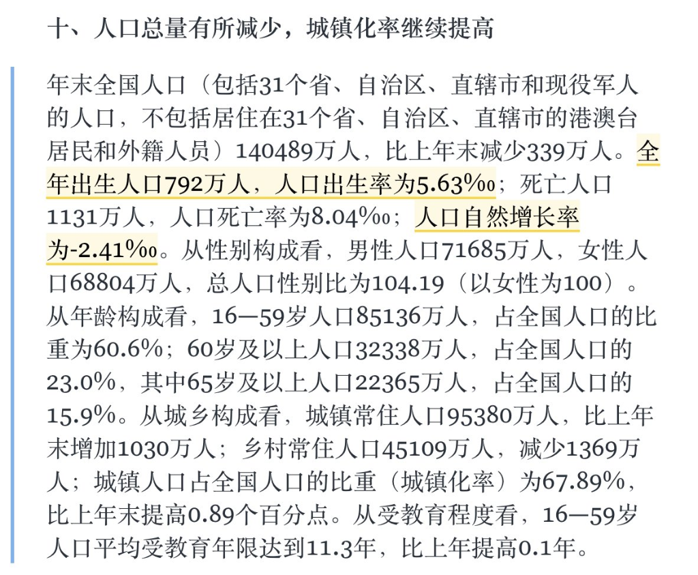

# 2025年中国人口数据分析报告

## 1. 数据概览

根据发布的统计公报显示，2025年末全国人口数据呈现以下关键特征：

*   **人口总量**：14亿0489万人
*   **人口变动**：比上年末减少 **339万人**
*   **出生人口**：792万人（出生率 5.63‰）
*   **死亡人口**：1131万人（死亡率 8.04‰）
*   **自然增长率**：**-2.41‰**
*   **城镇化率**：67.89%（比上年末提高0.89个百分点）
*   **老龄化**：60岁及以上占比 23.0%，其中65岁及以上占比 15.9%

## 2. 深度解读

### 2.1 负增长加速 (Accelerated Negative Growth)
数据最显著的特征是人口负增长的**加速趋势**。从2022年的首度负增长，到2025年减少339万人，减幅在显著扩大。死亡人口（1131万）持续高于出生人口（792万），这种“剪刀差”正在固化。这意味着中国正式进入了长周期的人口减量发展阶段。

### 2.2 少子化严峻 (Severe Low Fertility)
出生人口跌破800万大关至792万人，出生率仅为5.63‰。这一数字远低于世代更替水平（约2.1）。这反映了育龄妇女减少、生育意愿下降以及婚育年龄推迟的综合影响。
**影响**：
- **母婴市场**：传统的奶粉、尿布、儿童教育市场将面临存量博弈甚至缩量竞争。
- **教育体系**：幼儿园关停潮可能会向小学、中学蔓延，教育资源面临重新配置。

### 2.3 深度老龄化 (Deepening Aging)
60岁及以上人口占比达23.0%，意味着接近四分之一的人口为老年人。65岁及以上占比15.9%，远超深度老龄化社会标准（14%）。
**影响**：
- **银发经济**：养老服务、医疗健康、适老化改造、老年旅游等行业将迎来爆发式增长。
- **社保压力**：养老金支付压力增大，现收现付制面临挑战，延迟退休政策实施的紧迫性进一步增强。

### 2.4 城镇化仍有空间 (Urbanization)
城镇化率达到67.89%，仍保持近1个百分点的增长。虽然速度放缓，但人口向城市（特别是核心城市群）集聚的趋势未变。
**影响**：
- **房地产**：普涨时代结束，分化加剧。人口流出的收缩型城市房产需求疲软，而此时人口流入的一二线城市仍有刚需支撑，但总量天花板已现。

## 3. 宏观影响与建议

### 3.1 经济增长模式转型
人口红利（数量）的消退意味着必须转向**“人才红利”**。
- **劳动力成本**：廉价劳动力时代一去不复返，企业必须加速**自动化、数字化和智能化**转型（AI Agent, Robotics）。
- **全要素生产率**：经济增长将更多依赖技术进步和效率提升。

### 3.2 消费结构变迁
- 消费主力军从中青年向中老年扩散。
- 消费需求从“有没有”向“好不好”转变（服务型消费占比提升）。

### 3.3 投资启示
- **看空**：依赖人口数量扩张的传统行业（如传统地产、低端制造、大众快消）。
- **看多**：
    1.  **AI与自动化**：替代短缺的劳动力。
    2.  **医药生物与医疗器械**：服务庞大的老年群体。
    3.  **养老服务**：由于家庭结构小型化（少子老龄化），社会化养老需求激增。

## 4. 总结
这张数据图不仅是一份统计公报，更是中国社会经济结构的**体检表**。它宣告了依靠人口规模扩张的粗放增长模式彻底终结。对于个人和企业而言，顺应“减量提质”的大趋势，布局“老龄化”和“智能化”赛道，是未来十年最重要的战略选择。
