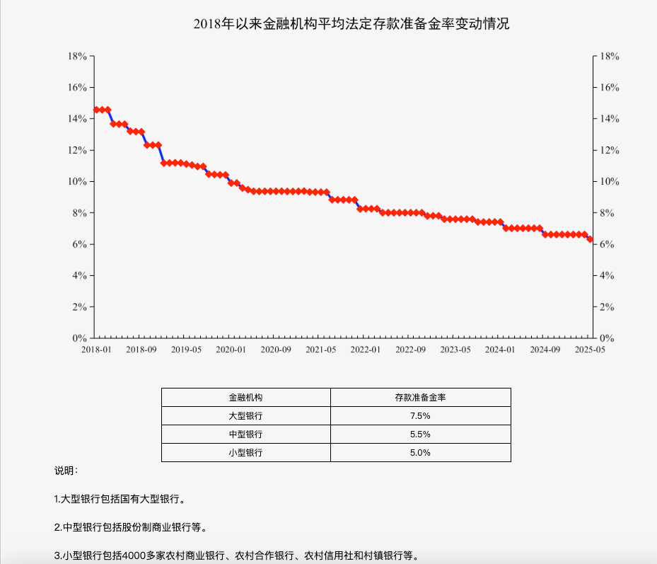

# China Monetary Policy Analysis: RRR Trends (2018-2025)

_(External Perspective: Global Market Insights Report)_

## 🏛️ Analyst Commentary: The Great Pivot

Since 2018, the People's Bank of China (PBoC) has executed a strategic, long-term reduction of the Required Reserve Ratio (RRR). This is not just a standard loosening; it’s a fundamental restructuring of how liquidity is managed in the world's second-largest economy.

> [!NOTE] > **The Paradigm: Why Does the RRR Exist?**
>
> Simply put, the RRR serves as the "Dual Control System" of a central bank:
>
> 1. **The Economy's "Faucet" (The Monetary Valve)**
>    - Imagine the economy as a vast farmland. If the central bank senses a drought (stagnant spending), it **lowers** the RRR (opens the faucet), releasing hundreds of billions into the market.
>    - Conversely, if the economy is overheating (excessive speculation), it **raises** the RRR (tightens the faucet) to drain excess cash and prevent a financial storm.
> 2. **The Depositor's "Safety Net" (The Security Buffer)**
>    - Banks are inherently leveraged; they lend out most of what you deposit to maximize profits.
>    - Without a buffer, a "bank run" (everyone withdrawing at once) would instantly collapse the system. The RRR forces banks to keep a fixed percentage in the central bank's "vault." It is the ultimate insurance policy ensuring systemic resilience.

### 1. The Secular Downward Trend

The average RRR has compressed from **~14.5%** in early 2018 to **~6.6%** in May 2025.

- **The Analyst's View:** This represents a transition from a high-reserve/high-growth model to a "liquidity-starved, structural support" model. By lowering the RRR, China is replacing volatile, short-term liquidity tools with stable, long-term capital to support a maturing economy.

> [!CAUTION] > **Deep Dive: The "Real" Reason Behind the Shift (Plain English)**
>
> Imagine the economy as a person growing from a "Teenager" to a "Mature Adult":
>
> 1. **The Past (The Teenager) - Real Estate (Fast Money):** Growth used to rely on property and infrastructure. This is like "fast food"—money comes back quickly (1-2 years). Banks were fine using "short-term bridge loans" from the central bank because they knew the money would return fast enough to repay the debt.
> 2. **The Present (The Adult) - Semiconductors & Deep Tech (Patient Money):** Now, growth relies on high-tech and R&D. This is like "planting an orchard"—it takes 5-10 years before you see a single apple.
>    - **The Conflict:** If a bank's money is a "short-term loan" that must be returned to the central bank next week, it will **NEVER** dare to lend it to a tech company that needs 10 years to repay.
>    - **The Solution:** RRR cuts "unlock" a bank's **own money** permanently. Only with this "Patient Capital" (money with no deadline) can banks support the slow-moving but vital innovation that a mature economy requires.
>
> **The Bottom Line:** China is no longer chasing "Speed." It is chasing "Depth." To do that, the financial system must move away from "erratic heartbeats" (short-term injections) toward a "steady, deep pulse" (long-term capital).

> [!TIP] > **Conceptual Insight: Long-term Capital vs. Short-term Tools**
>
> - **Short-term Tools (e.g., Reverse Repo, MLF):** These are like "bridge loans" from the central bank with maturities of 7 days to 1 year. Banks are hesitant to issue long-term credit with this money because they must constantly worry about repayment and rollover risk.
> - **Long-term Capital (via RRR cuts):** This "unlocks" cash originally frozen in reserves. Since there is no repayment deadline, banks view it as permanent liquidity. This stability encourages them to fund long-gestation projects like infrastructure and R&D, which are vital for a maturing economy.

### 2. Tiered Reserve Architecture: Strategic Segmentation

The PBoC has implemented a sophisticated three-tier RRR system:

- **Large Banks (7.5%):** Acting as the systemic "anchor," these state-owned giants maintain higher buffers to ensure overall financial stability.
- **Mid-sized Banks (5.5%):** Balancing market-driven growth with regulatory caution.
- **Small/Community Banks (5.0%):**
  > [!IMPORTANT] > **The 2.5% Alpha (Scale Impact):** To an external observer, a 2.5% spread seems marginal. However, on a deposit base of **~1.5 Trillion USD (10T RMB)** for these smaller institutions, this "spread" unlocks **~$37 Billion USD (250B RMB)** in potential credit. This is equivalent to funding **250,000 small businesses** or building **750 miles (1,200km)** of high-speed rail. It is a massive targeted stimulus hidden in plain sight.

---

## 🔍 Key Definitions for Global Investors

### 🌊 "Flood Irrigation" vs. "Targeted Drip"

- **Flood Irrigation (大水漫灌):** The indiscriminate spraying of capital across the economy, which historically led to property bubbles and inflation.
- **The Pivot:** The tiered RRR system is effectively a **Targeted Drip (精准滴灌)** mechanism, ensuring that "water" (capital) reaches the intended "roots" (SMEs and rural sectors) without drowning the entire field.

### 📉 Cost of Capital (资金成本)

For banks, reserves held at the PBoC earn negligible interest. RRR cuts "unlock" this non-productive cash. This reduces the **Cost of Capital**, allowing banks to lower lending rates without squeezing their margins—a critical move to stimulate private investment during economic headwinds.

---

## 🚀 Extension: How to Set Your "Personal RRR"?

If you treat your **Personal Net Worth** like a bank, you can define your own "Personal RRR":

1. **What is Personal RRR?**

   - It is the ratio of your **Cash & Liquid Reserves** to your **Total Assets**.
   - **Formula:** `Personal RRR = Emergency Fund / Total Assets`

2. **How to Set Your Ratio? (Modeling the PBoC’s Three-Tier Architecture)**

   - **"Large Bank" Protocol (10%-15%):** If you have high liabilities (mortgages, dependents). You need a higher RRR to ensure that in an emergency, you aren't forced to liquidate long-term investments (like stocks) at a loss.
   - **"Medium Bank" Protocol (5%-10%):** If you have a stable salary and are in a wealth-accumulation phase. A moderate buffer is sufficient.
   - **"Small Bank" Protocol (3%-5%):** If you are highly agile (e.g., minimalist lifestyle or consistent passive income). You can maintain a ultra-low RRR to maximize exposure to high-yield assets.

3. **The Philosophy:**
   - The RRR is a trade-off between **Resilience** and **Yield**.
   - **Cutting your RRR:** When you spot a massive market opportunity, you "cut your reserves" to inject liquidity into your portfolio.
   - **Raising your RRR:** When you sense macro-economic headwinds or uncertainty in your job sector, you "raise reserves"—locking cash away to ensure survival.

#### 🛠️ Decision Matrix for Your Personal RRR

| Category        | **When to "Cut" (Add Liquidity)** | **When to "Raise" (Build Buffer)**         |
| :-------------- | :-------------------------------- | :----------------------------------------- |
| **Income**      | New stable passive income sources | Signs of layoffs or industry downturn      |
| **Liabilities** | Paying off a mortgage/major loan  | New debt commitments (e.g., student loans) |
| **Market**      | Deep discounts in target assets   | Irrational exuberance/High asset prices    |
| **Life Stage**  | Children become independent       | Marriage, new baby, or moving house        |

---

## 📈 Summary of the Macro Thesis

From a global perspective, China's RRR trajectory shows a central bank that is meticulously managing a slowing economy while attempting to avoid the credit traps of the past. The 2018-2025 chart is a blueprint of **Structural Easing**: doing more with "less" by being smarter about where every yuan resides.
